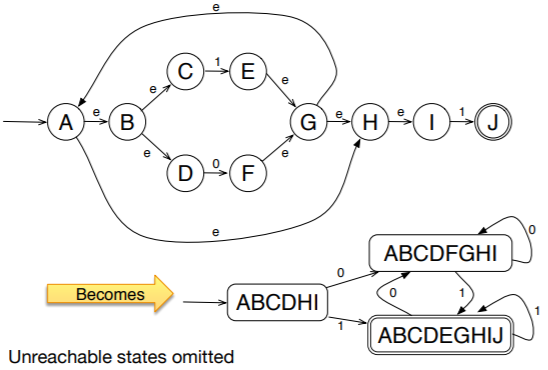

# Finite State Automata

- TL;DR revise maths FSA notes
- A word is accepted by an FSA exactly if there i a path in the FSA from the initial state such that the edge labels we encounter on this path exactly spell the word w
- Can translate FSAs into regex and vice versa

## Formal Definition

- Has 5 components
  - Finite set called the alphabet of the automaton
  - Non-empty finite set of states
  - an initial state
  - Terminal/accepting states of the automaton
  - Transition relation
- It's non-deterministic if there are paths accepting the same character going from the same node
  - For any non-deterministic automaton, there's a deterministic alternative

## Why Non-Deterministic?

- Making a non-deterministic FSA is usually much smaller (fewer states)
  - Often exponentially so: if the NFA has n states, the DFA might have approximately 2<sup>n</sup> states
- Deterministic FSAs can be implemented on real machines
- We can look at the problem from 2 angles; what's more human friendly and what's more machine friendly?

## FSA Versus Regex

- Going straight from regex to deterministic FSAs is complicated so there are several steps
  1. Lexical specification
  2. Regular expressions
  3. NFA, epsilon automata
  4. DFA
  5. Table-driven implementation of DFA

## Epsilon Automata

- Formally an epsilon automaton with alphabet A is a FSA with alphabet A union {epsilon}
- If we want to have an automaton accepting language A then B, join the 2 languages with an epsilon edge

## From NFAs To DFAs

- Basically, remove the epsilons in between 2 nodes that have edges that consume



- Consider the example, the NFA has 10 states
- The DFA version would have `2¹⁰ - 1 = 1023`

### Implementation of DFAs

- A DFA is actually a 2D table
  - Table columns are indexed by the alphabet and rows are indexed by the states
  - Element at row `X` and column `c` stores the next state in the automaton when starting in state `X` and consuming `c`

```javascript
def scan(input : Array[Char]) : Boolean {
  val table = ... // transitions
  var i = 0 // current character
  var s = A // current state
  val acceptingState = C
  while (i < input.length) {
    s = table[s, input[i]]
    i += 1
  }
  return (s == acceptingState)
}
```

#### Mealy Automaton

- This doesn't just consume an input, but it can also construct an output as well

### Lexer Generators

- Allows you to use java code with regular expressions
- Gonna be using `Flex` and `JFlex`
  - Weird JFlex but OK
- Fast lexing
- An expert can probably make a faster lexer than with a generator
- Can potentially use regex for lexing, but it is very slow
