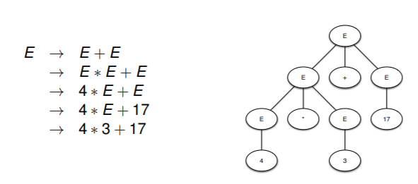

# Syntax Analysis

- We want to
  - Specify that a program is syntactically correct programs are correct
  - Check that a input program is syntactically correct according to the specification, and output an AST
- FSAs and REs can't count
  - So can't for example balance brackets

## Context Free Grammars

- Context free grammars will specify what the syntax of a language is
- They have variables on the left, and then the variables will be assigned to strings on the right where the right can consist of other variables/strings which can lead to recursive definitions
- Conventions for CFGs

```text
N -> f1
N -> f2
N -> f3

can become

N -> f1 | f2 | f3

then also

P -> if P then P | while P do P

can become

P, Q -> if P then Q | while P do Q


finally write ::= instead of ->
```

### CFG Example

- `A = {a, b}`
- `V = {S}`
- The initial variable is `S`
- `R` contains only 3 reductions
  - `S -> a S b`
  - `S -> S S`
  - `S -> epsilon`
- Note that epsilon is the empty string
- Now the CFG is `(A, V, S, R)`

### Language Accepted By A CFG

- The language of a CFG is the set of all strings over the alphabet of the CFG that can be arrived at by rewriting from the initial variable
- The produced output from the CFG must not have any variables left in the string as well, else it will not be accepted

### CFGs VS REs

- Why not do lexing as well as syntax analysis with CFGs?
  - CFGs are slower than REs (and FSAs)
- REs are simpler and faster

### Parse Trees



- Terminal symbols are the leaves of the tree
- Variables are at the non-leaf nodes
- An in-order traversal of the tree returns the input string
- The parse-tree reveals the bracketing structure explicitly
- The order in which you derive the parse-tree from will not make a difference, since this is context free
- A CFG is ambiguous if there is one or more rules that can be applied at the same time
  - Can lead to different code generation

#### Top Down Parsing

- Recall the grammar:

```text
P -> begin Q
P -> prog
Q -> end
Q -> P; Q
```

- We use methods, one for each variable (can be programmed in other ways)

```text
def parseQ( tl : List [Token]) = ...
def parseP( tl : List [Token]) = ...
```

- Now parse P like this:

```text
Parsing these rules:
P -> begin Q
P -> prog

def parseP( tl : List [Token]) : Result
  if tl is of form
    T_begin :: rest then perseQ ( rest )
  else if tl is of form
    T_prog :: rest then
      Some ( ProgAST (), rest )
  else None
```

- Parsing Q is a little more intense ...

```text
Parsing these rules:
Q -> end
Q -> P; Q

the stars signify the returned values of the function

def parseQ( tl : List [Token]) : Result
  if tl is of form
    T_end :: rest then *Some(( EmptyAST, rest ))*
  else
    if parseP(tl) is of form
      None then *None*
      Some(( astL, restL )) then
        if restL is of form
          T_semicolon :: restLL then
            if parseQ( restLL ) is of form
               None then *None*
               Some(( astR, rest2 )) then
                *Some( SeqAST( astL, astR ), rest2 )*
        else *None*
    else *None*
```

#### Parse Trees VS ASTs

- Parse trees produce a tree from a CFG that has the variables from the CFG as well even though they are redundant
- ASTs are a simplified version, only showing the absolute necessary info
- Left recursive grammars can have infinite looping
